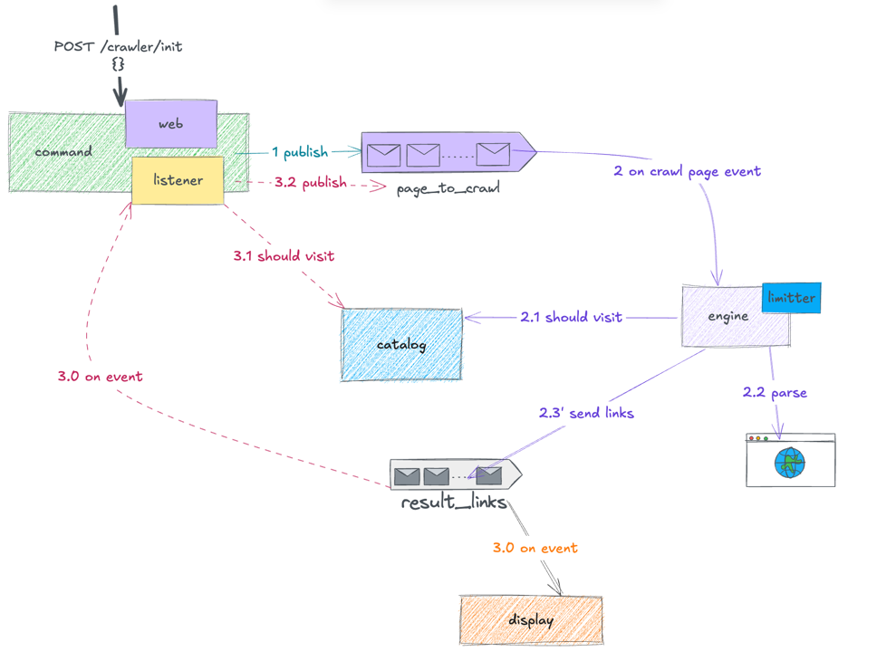

# Web Crawler as multi module app

This is a sample of project in order to demo:
1. spring boot modulith
2. spring internal events
3. TBD

## 3. HLD

#### There are four main components:
- command - it is responsible for initiating the crawling a single page by a URL; the trigger could be done via REST or EVENT
- engine - subscribes for PageToCrawlEvent, extracts the links from the web page in case it was not yet crawled and emits PageResultEvent
- display - on PageResultEvent, log the links
- catalog - in memory solution for storing the links that were already crawled